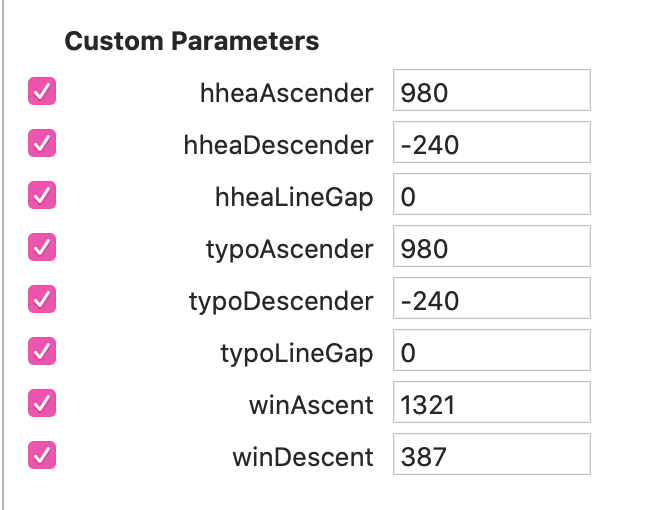

# Rellenando el Font Info

La mayoría del "Font Info" es sencillo, o al menos engañosamente sencillo. Aquí no me meto en lo obvio ni en opciones que sirven para cosas muy específicas. Es más un recordatorio de lo que se me olvida siempre que una guía completa de lo que hay que poner.

## Pestañas

### Font:

- Activar "Use typo metrics"
- "fsType Embedding": Editable.
- "glyphOrder" desordena la ventana Font, se puede hacer y activar al final del todo.
- "Family Alignment Zones"
- "unicodeRanges & codePageRanges"
- "Export Mac Name Table Entries" desactivado
- "Panose": No sirve pa na. Ponerlo vacío y rellenar sólo si es monoespaciada.

Si la tipo es monoespaciada: "isFixedPitch" activado.

### Masters: Hinting

- "Autohinting: Zones": Meter zonas extra para versalitas, numerales pequeños, etc.
- "Autohinting: Stems": Cuantos menos valores metamos, mejor. Como si es uno vertical y otro horizontal.

### Masters: Vertical Metrics

Recuerden: Activar "Use_Typo_Metrics" en Fonts.

Para calcular los VM, mejor hacerlo con el máster más pesado y copiar los resultados en los demás masters. 

**Porque ojo: Toda la familia debe tener los mismos valores.**

Podemos usar el Script "Mekkablue Font Info / Vertical Metrics Manager" para ahorrar tiempo o hacerlo a manita.

#### Valores hhea

- "hheaAscender" = Un poco más de la altura de la mayúscula acentuada (con un solo diacrítico) - más alta. Normalmente Á o Å, idealmente >Á.
- "hheaDescender" = Un poco más del punto más bajo de la minúscula más baja. Normalmente g o ç, idealmente >g. 
- "hheaLineGap" = 0

No deben sumar 1000 necesariamente. Algo cerca de 1200 es deseable.

#### Valores Typo

- "typoAscender" = "hheaAscender"
- "typoDescender" = "hheaDescender"
- "typoLineGap" = 0

En resumen, hhea==typo.

#### Valores Win

- "winAscent" == El punto más alto de la familia (Para encontrarlo: "Mekkablue / Test / Report Highest and Lower...")
- "winDescent" == El punto más bajo de la familia (valor integro, aunque sea negativo, ponemos positivo).

Si tras exportar, usamos el script "Test/Webfont Test HTML" con Metrics activado vemos como queda de centrada la tipo en un fondo gris. Si pensamos en nuestra tipo en un botón web, estaría bien que quedase centrado.

### Exports:

Esto se entiende mucho mejor si antes lees sobre el archivo OpenType.

### Exports: General

- "Name Table Entry: 1; " 
    + El nombre de la familia si es RIBBI: *Times New Roman*
    + El nombre del peso si no: *Times New Roman SemiBold*
- "Name Table Entry: 2; "
    + Si es RIBBI: *Regular, Bold, Italic, Bold Italic*
    + Si no es RIBBI: *Regular o Italic*
- "Full Name" o "Custom P: Name Table Entry: 4; " 
    + Nombre de fuente + nombre de estilo: *Times New Roman Bold Italic*
- "Font Name" o "Custom P: Name Table Entry: 6; "
    + Nombre Postscript: *TimesNewRoman-BoldItalic*
- "WWS Family Name": Para tipos con estilos que no se ajusten a *Weight Width Slope*, como Optical Sizes: *Times New Roman Display*
- "WWS Subfamily Name:": *Bold Italic*

### Exports: Style Linking

Importante para que el cuarteto RIBBI funcione bien en programas de mierda.

El resto de instancias sólo se linka con su italic (no intentar que Medium tenga su Bold, vamos).

### Exports: Custom Parameters

- "Rename Glyphs":
    + Si tenemos versiones .bold de p. ej. el $ para nuestra variable y queremos exportarlas en estáticas por defecto.

## Variables

### Export para Variables

- "Add Variable Font Setting"
- "Name:" Regular o Italic
- "Localized Family Names: " Si exportamos tanto estáticas como variables, cambiamos el nombre a la variable para que se distinga en el menú: *Times New Roman Variable*
- "Variations PostScript Name Prefix: " Para poner un nombre postcript, sin espacios, a nuestro gusto: *TimesNewRomanVF-Roman*

### Custom Parameters

- Establecer "Variable Font Origin". Tiene que ser un máster. Si queremos Style Linking que vaya de Regular y Bold, el Regular tiene que ser máster. Si no, volverá de Bold al máster de origen.
- "File Name:" Para que el archivo a exportar tenga el nombre que queramos y se distinga de las estáticas: *TimesNewRomanVF-Roman*
- "Name Table Entry: 1; ": El nombre de la familia + VF, variable...: *Times New Roman Variable*
- "Name Table Entry: 2; ": *Regular o Italic*
- "Full Name" o "Custom P: Name Table Entry: 4; ": Nombre de fuente + nombre de estilo: *Times New Roman Variable*

En las instancias estáticas: "Axis Location": Para la tabla `AVAR` en fuentes variables. Convierte nuestras coordenadas de diseño en coordenadas para el usuario, con un peso 400 en Regular, 700 en Bold, etc. más sencillas de usar.

- Se chequea en [https://www.axis-praxis.org/samsa/](https://www.axis-praxis.org/samsa/)
- Con el plugin "mekkablue/UnnestComponents" añadimos el CP "Filter: UnnestComponents".
- Con el script "Mekkablue / test / Variable Font test HTML" podemos probar la fuente tras exportar.

### Other

"Font Type": Variable

### Cursivas en fuentes variables

Si tenemos una tipo inclinada lo normal es que vaya en el mismo archivo y todo vaya bastante bien, pero si tenemos cursivas auténticas en una variable tendremos dos archivos que no interpolan entre sí, pero querremos que funcione el style linking.

Aunque tengamos una Slant, es mejor llamar al eje Italic (vete a saber por qué).

Las instancias deben tener *Style Linking*. Cada peso con su par en la romana, y la Bold Italic con Regular.

### Export:

En "Variable Font Setting":
- "Name:" Italic
- "Localized Family Names: " Igual que en la romana: *Times New Roman Variable*
- "Variations PostScript Name Prefix: " Añadimos Italic: *TimesNewRomanVFItalic*
- "FileName:" *TimesNewRomanVFItalic*

### En TTX

- Podemos chequear en `MacStyleValue` y `fsSelectionValue`.
- Nombres Postscript: Al crearlos Glyphs pone dos veces Italic. No es importante pero podemos borrar el segundo para acortarlo: `TimesNewRomanVFItalic-Regular `

