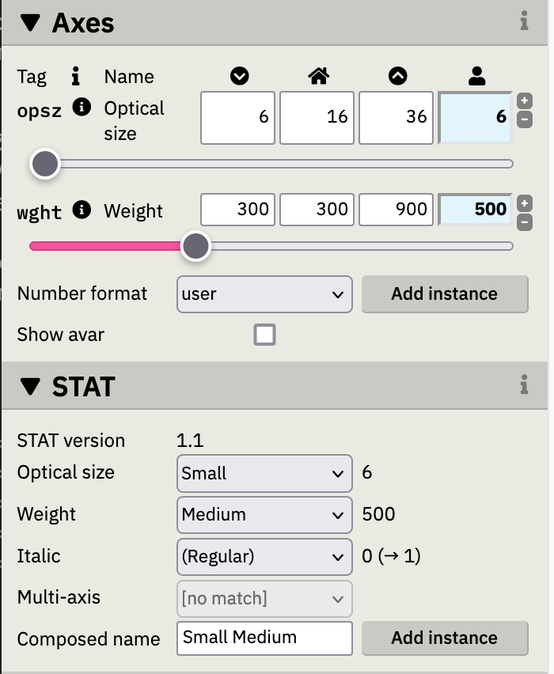

# El archivo OpenType

Al exportar desde Glyphs, creamos archivos .ttf .otf .woff etc. Por mucho que nos guste Glyphs, hay cosas que no acaban de exportarse como deberían (al menos en mayo de 2023).

Aquí hay un buen cirio montado entre lo que dice la [especificación OpenType](https://learn.microsoft.com/es-es/typography/opentype/spec/) que debe ser el archivo, lo que exporta Glyphs y lo que los sistemas operativos y los programas de todo tipo leen en el archivo. Si entendemos algo el archivo podremos ver porqué fallan las cosas y si podemos arreglarlas.

En el archivo la información se guarda en tablas, una para los nombres, otra para los trazados, para el orden de los glifos, etc.

Hay programas como [OTMaster](https://www.fontmaster.nl/otmaster.html) y [FontTable Viewer](https://glyphsapp.com/tools/fonttableviewer) (gratuito) para ver las tablas de los archivos OpenType.

Para acceder de forma sencilla y modificar el archivo (incluso con programación Python) necesitaremos TTX.

## TTX

TTX es un programa que convierte un archivo .otf o .ttf a XML haciendo que sea legible. Luego también convierte el XML de vuelta al tipo de archivo que queramos.

- Botón derecho sobre la carpeta que tengamos la fuente / "Abrir terminal en la carpeta".
- `ttx (arrastramos el archivo.otf)` → `ttx Usuario/ruta_al_archivo.otf|ttf`

Y ya podemos abrirlo con un editor de texto ( va guay, hay que indicarle que es un XML abajo a la izquierda).

- `ttx archivo.ttx`: Y vuelve a ser otf.
- `ttx -f archivo.ttx`: Sobreescribe el otf original
- `ttx -t -STAT (archivo)`: Extrae sólo la tabla `STAT`.
- `ttx -t -STAT -o STAT.ttx (archivo)`: extrae sólo la tabla `STAT` y nombra el archivo ttx como - queramos.
- Para volver a unir (merge) la `STAT` al archivo: `ttx -m "archivoVAR.ttf" -o "archivoVAR.ttf" STAT.ttx`

Una vez que tenemos la tablas al aire, vamos a ver algunas:

## Tablas Opentype

### `name`

En la tabla `name` se encuentran todas las palabras en una fuente. Las cosas que nosotros tenemos que leer tipo el Copyright, el diseñador, los nombres de los pesos, etc. Cuando rellenamos algo en Font Info, normalmente va a parar a la tabla name.

Hay 26 (del 0 al 25) nombres (nameID) que están predefinidos. nameID="0" sería el copyright, por ejemplo. [Aquí puedes verlos todos](https://learn.microsoft.com/es-es/typography/opentype/spec/name).

Luego, del 256 en adelante están libres para lo que sea. Entre el 26 y el 255 no se pone nada.

La única parte complicada de la tabla name es nombrar correctamente las familias y estilos. Por temas de compatibilidad con sistemas operativos y formatos de fuentes antiguos, nombrar las fuentes y estilos y que se vean en los menús como queremos no es tan sencillo como podría parecer. 

Si rellenamos bien el "Font Info", Glyphs nos rellenará la tabla `name` bien y podremos seguir sin tener que cambiar nada. Vemos a ver qué nameID tenemos y para qué sirven:

#### ID 1 e ID 2

Son IDs para Windows. Para programas en los que las familias sólo tienen cuatro estilos que se escogen con style linking: Regular, Italic, Bold y Bold Italic (RIBBI).

- `ID 1: Family Name: Times New Roman`
- `ID 2: Subfamily Name: Regular, Italic, Bold o Bold Italic`

El resto de la familia tiene este aspecto:

- `ID 1: Family Name: Times New Roman SemiBold`
- `ID 2: Subfamily Name: Regular o Italic`

Para **Word** incluso podemos acortar (Rg, It, Bd, etc) porque el menú es estrecho.

#### ID 16 e ID 17

Son los IDs de los menús fetén, los de Adobe y similares. Tenemos el nombre de la tipo y luego el submenú con todos los estilos.

- `ID 16: Typographic Family Name: Times New Roman`
- `ID 17: Typographic Subfamily Name: SemiBold Italic`

#### ID 21 e ID 22

Nombres WWS: Weight Width Slope. Sólo se ponen en ID 22 estos tres ejes. Normalmente no se necesita poner.

- `ID 21: WWS Family Name: Times New Roman Display`
- `ID 22: WWS Subfamily Name: SemiBold Condensed`

#### ID 4

Es la suma del 16 y 17

- `ID 4: Full Font Name: Times New Roman SemiBold Italic`

#### ID 6

El nombre PostScript. Es el nombre completo pero sin espacios. El espacio entre familia y estilo se sustituye por un guión. Es importante porque es el que usa, por ejemplo, el PDF.

- `ID 6: PostScript Name: TimesNewRoman-SemiBoldItalic`

---

En principio deberíamos tenerlo todo en su sitio si rellenamos bien los nombres en el "Font Info". Con el custom parameter "Font / Name Table Entry" podemos rellenar algunos de los parámetros a mano.

### `OS/2`

Tiene métricas para representar las fuentes. Aquí va lo que ponemos en Weight class, Width class, Panose, fsType, algunas vertical metrics, etc. En principio no hay mucho que pueda fallar aquí.

### `STAT`

La tabla `STAT` ahora mismo no puede leerla ningún programa, pero en teoría será la que se use en el futuro para nombrar los estilos de las fuentes. Vamos, que otra tabla extra para lo mismo.

La idea es que en un mundo de fuentes variables con tropecientos estilos los menús clásicos serán impracticables, así que describiendo cómo son nuestros ejes y donde están las instancias, las combinaciones nos darían el nombre del lugar del espacio de diseño en el que estamos.

Todo esto sería genial si no fuese porque Glyphs (versión 3.2 en mayo de 2023) no la exporta perfecta. Así que aquí SÍ que toca meter mano al XML (si usas Glpyhs 3.1 es directamente escribirla a mano de lo mal que está)

Si exportamos una tipo variable con tres ejes `opsz`, `wght` e `ital`, podemos abrirla en [Samsa](https://www.axis-praxis.org/samsa/) y ver cómo se comporta en la pestaña STAT.



#### Qué pinta tiene

Y si nos movemos por nuestro XML hasta llegar a la STAT veremos algo así:

```xml
<STAT>
<Version value="0x00010001"/>
<DesignAxisRecordSize value="8"/>
<!-- DesignAxisCount=3 -->
<DesignAxisRecord>
  <Axis index="0">
    <AxisTag value="opsz"/>
    <AxisNameID value="256"/>  <!-- Optical size -->
    <AxisOrdering value="0"/>
  </Axis>
  <Axis index="1">
    <AxisTag value="wght"/>
    <AxisNameID value="257"/>  <!-- Weight -->
    <AxisOrdering value="1"/>
  </Axis>
  <Axis index="2">
    <AxisTag value="ital"/>
    <AxisNameID value="313"/>  <!-- Italic -->
    <AxisOrdering value="2"/>
  </Axis>
</DesignAxisRecord>
```

Lo que nos interesa aquí:

`<!-- DesignAxisCount=3 -->` 

Osea, que hay tres ejes

```xml
<Axis index="0">
  <AxisTag value="opsz"/>
  <AxisNameID value="256"/>  <!-- Optical size -->
  <AxisOrdering value="0"/>
</Axis>
```

y el primero es el número 0 (los ordenadores empiezan a contar por cero), tiene el tag `opsz`, su nombre está en la tabla name en el ID 256 ("Optical size") y tiene el orden 0 en los menús. El eje italic (`ital`) está siempre aunque no haga falta, vete a saber porqué.

El orden recomendado para los ejes es: `opsz-wdth-wght-ital`.

En principio todo bien, sólo es para entenderlo. Vemos que los ejes están descritos al principio de la tabla.

#### Instancias

Ahora vamos con las instancias:

```xml
<!-- AxisValueCount=13 -->
<AxisValueArray>
  <AxisValue index="0" Format="1">
    <AxisIndex value="0"/>
    <Flags value="0"/>
    <ValueNameID value="260"/>  <!-- Small -->
    <Value value="6.0"/>
  </AxisValue>
  <AxisValue index="1" Format="1">
    <AxisIndex value="0"/>
    <Flags value="2"/>  <!-- ElidableAxisValueName -->
    <ValueNameID value="2"/>  <!-- Regular -->
    <Value value="10.0"/>
  </AxisValue>
  <AxisValue index="2" Format="1">
    <AxisIndex value="0"/>
    <Flags value="0"/>
    <ValueNameID value="287"/>  <!-- Subhead -->
    <Value value="18.0"/>
  </AxisValue>
  <AxisValue index="3" Format="1">
    <AxisIndex value="0"/>
    <Flags value="0"/>
    <ValueNameID value="301"/>  <!-- Display -->
    <Value value="36.0"/>
  </AxisValue>
  <AxisValue index="4" Format="1">
    <AxisIndex value="1"/>
    <Flags value="0"/>
    <ValueNameID value="272"/>  <!-- Book -->
    <Value value="300.0"/>
  </AxisValue>
  <AxisValue index="5" Format="1">
    <AxisIndex value="1"/>
    <Flags value="2"/>  <!-- ElidableAxisValueName -->
    <ValueNameID value="2"/>  <!-- Regular -->
    <Value value="400.0"/>
  </AxisValue>
  <AxisValue index="6" Format="3">
    <AxisIndex value="1"/>
    <Flags value="2"/>  <!-- ElidableAxisValueName -->
    <ValueNameID value="2"/>  <!-- Regular -->
    <Value value="400.0"/>
    <LinkedValue value="700.0"/>
  </AxisValue>
  <AxisValue index="7" Format="1">
    <AxisIndex value="1"/>
    <Flags value="0"/>
    <ValueNameID value="275"/>  <!-- Medium -->
    <Value value="500.0"/>
  </AxisValue>
  <AxisValue index="8" Format="1">
    <AxisIndex value="1"/>
    <Flags value="0"/>
    <ValueNameID value="277"/>  <!-- SemiBold -->
    <Value value="600.0"/>
  </AxisValue>
  <AxisValue index="9" Format="1">
    <AxisIndex value="1"/>
    <Flags value="0"/>
    <ValueNameID value="279"/>  <!-- Bold -->
    <Value value="700.0"/>
  </AxisValue>
  <AxisValue index="10" Format="1">
    <AxisIndex value="1"/>
    <Flags value="0"/>
    <ValueNameID value="281"/>  <!-- Black -->
    <Value value="800.0"/>
  </AxisValue>
  <AxisValue index="11" Format="1">
    <AxisIndex value="1"/>
    <Flags value="0"/>
    <ValueNameID value="283"/>  <!-- Heavy -->
    <Value value="900.0"/>
  </AxisValue>
  <AxisValue index="12" Format="3">
    <AxisIndex value="2"/>
    <Flags value="2"/>  <!-- ElidableAxisValueName -->
    <ValueNameID value="2"/>  <!-- Regular -->
    <Value value="0.0"/>
    <LinkedValue value="1.0"/>
  </AxisValue>
</AxisValueArray>
<ElidedFallbackNameID value="2"/>  <!-- Regular -->
</STAT>
```

Y aquí vemos que hay 13 instancias: 4 para tamaños ópticos, 7 para pesos, y dos repetidas de Regular (El Regular de abajo del todo es otra cosa).

Cada peso tiene esta estructura:

```xml
<AxisValue index="8" Format="1">
  <AxisIndex value="1"/>
  <Flags value="0"/>
  <ValueNameID value="277"/>  <!-- SemiBold -->
  <Value value="600.0"/>
</AxisValue>
```

Esto es la instancia 8, que tiene formato 1.
Que está en el eje 1 (el segundo, Weight, el primero es 0)
Lo del Flags 0 es que es una instancia del montón
El nameID es donde tenemos el texto "SemiBold" que aparecerá en los menús.
Y está en el punto 600 de nuestro eje.

Luego los Regulars tienen esto más raro:

```xml
<AxisValue index="5" Format="1">
  <AxisIndex value="1"/>
  <Flags value="2"/>  <!-- ElidableAxisValueName -->
  <ValueNameID value="2"/>  <!-- Regular -->
  <Value value="400.0"/>
</AxisValue>
<AxisValue index="6" Format="3">
  <AxisIndex value="1"/>
  <Flags value="2"/>  <!-- ElidableAxisValueName -->
  <ValueNameID value="2"/>  <!-- Regular -->
  <Value value="400.0"/>
  <LinkedValue value="700.0"/>
</AxisValue>
```

Están dos veces, la primera en formato 1 y las segunda en formato 3. La 1 es la normalita pero la 3 significa que ese peso de valor=400 tiene style linking, con un LinkedValue=700. Osea, que el Regular cambia a Bold si haces "Cmd-B" en Indesign o clicas la **B** del menú en un programa de textos.

En ambas el Flags value es 2 y pone `ElidableAxisValueName`. Eso significa que si nos movemos por el eje con los sliders en vez de Times Display Regular, pondrá Times Display a secas. Más que nada para que en una tipo con cuatro ejes no salga Times Regular Bold Regular Regular. 

#### Problemas

Aquí hay dos problemas:

1. Que no se recomienda tener duplicado el Regular en formato 1 y 3. Así que habría que borrar el primero. Es facilito con nuestro XML y para cuando leas esto igual ya está arreglado en Glyphs.
2. Que hay un formato 2 mucho mejor que el 1 que Glyphs no sabe hacer solito. En este formato especificamos el valor de la instancia, pero también un rango mínimo y máximo para que todas las posiciones del eje tengan nombre.

Tendría esta pinta:

```xml
<AxisValue index="8" Format="2">
  <AxisIndex value="1"/>
  <Flags value="0"/>
  <ValueNameID value="277"/>  <!-- SemiBold -->
  <NominalValue value="600.0"/>
  <RangeMinValue value="550.0"/>
  <RangeMaxValue value="650.0"/>
</AxisValue>
```

Donde antes había un sólo valor, ahora tenemos tres. Uno nominal también de 600 y un rango mínimo y máximo que suelen llegar a medio camino de la siguiente instancia. El el peso más fino el rango mínimo y el nominal sería el mismo y en el más grueso el nominal y el máximo también.

En cuanto al Regular y al style linking quedarían así:

```xml
<AxisValue index="5" Format="2">
  <AxisIndex value="0"/>
  <Flags value="2"/>  <!-- ElidableAxisValueName -->
  <ValueNameID value="2"/>  <!-- Regular -->
  <NominalValue value="400.0"/>
  <RangeMinValue value="350.0"/>
  <RangeMaxValue value="450.0"/>
</AxisValue>
<AxisValue index="6" Format="3">
  <AxisIndex value="0"/>
  <Flags value="2"/>  <!-- ElidableAxisValueName -->
  <ValueNameID value="2"/>  <!-- Regular -->
  <Value value="400.0"/>
  <LinkedValue value="700.0"/>
</AxisValue>
```

El Format 3 lo dejamos como está y el Format 1 lo pasamos al 2.

Ah, y abajo del todo de nuestra tabla tenemos el style linking para la Italic, que normalmente está en otro archivo. En este caso el valor de la romana es 0.0 y el de la cursiva 1.0:

```xml
<AxisValue index="12" Format="3">
  <AxisIndex value="2"/>
  <Flags value="2"/>  <!-- ElidableAxisValueName -->
  <ValueNameID value="2"/>  <!-- Regular -->
  <Value value="0.0"/>
  <LinkedValue value="1.0"/>
</AxisValue>
```

Y este trozo último es el nombre para cuando todos los ejes estén en Regular, que en ese caso sí aparece un Regular:

```<ElidedFallbackNameID value="2"/>  <!-- Regular -->```

Si ahora probamos en [Samsa](https://www.axis-praxis.org/samsa/) veremos que la fuente tiene nombre estemos donde estemos en el espacio de diseño. ¡Enhorabuena, hemos triunfado sobre la técnica!

### `AVAR`

Aquí vemos el mapeo que hemos hecho con `Axis Location`. El master de origen sería 0.0.

### `FVAR`

Aquí vemos definidos los ejes, las instancias y los nombres que tendrán en el menú.

- Encima de cada instancia tenemos su `postscriptNameID` y su `subfamilyNameID`.
- En el master de origen el `postscriptNameID` sale del ID 6 y el `subfamilyNameID` de ID 17
- En el resto se calcula con ID 25 + `subfamilyNameID`

En Glyphs podemos usar el *Custom Parameter* "Postscript Name Prefix" para poner el ID 25, que debe ser diferente a las estáticas. Si no se pone, Glyphs usará "Localized Family Name" sin espacios. 
